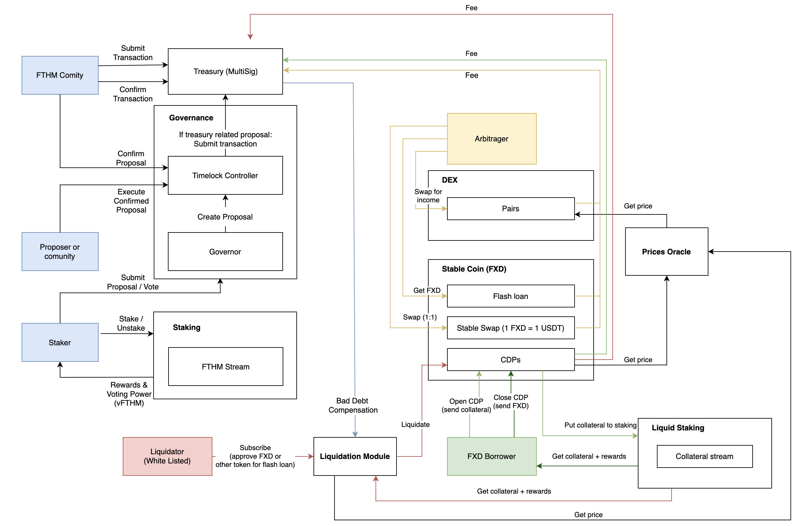
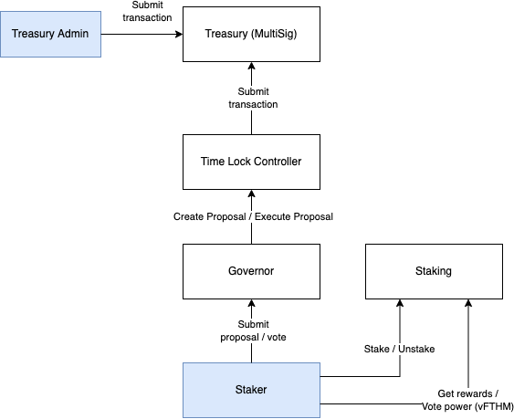

# Fathom Protocol
___

- [Fathom Protocol](#fathom-protocol)
  * [Overview](#overview)
  * [1. DAO](#1-dao)
  * [2. Votes token](#2-votes-token)
  * [3. Governance](#3-governance)
    + [3.1. Governance contract](#31-governance-contract)
    + [3.2. TimeLock Controller](#32-timelock-controller)
    + [3.3. Parameter Change Proposal Flow](#33-parameter-change-proposal-flow)
    + [3.4. Collateal Proposal Flow](#34-collateal-proposal-flow)
- [Governance technical specifications](#governance-technical-specifications)
  * [Vote Token](#vote-token)
      - [Inherited functionality:](#inherited-functionality-)
  * [Fathom Governor](#fathom-governor)
      - [Inherited functionality:](#inherited-functionality--1)
      - [Key Functions:](#key-functions-)
      - [Deployment and initialisation parameters:](#deployment-and-initialisation-parameters-)
  * [Multisig Treasury](#multisig-treasury)
        * [Functionality](#functionality)
        * [Key Functions:](#key-functions--1)
  * [Accesibility Permissions and Roles](#accesibility-permissions-and-roles)
  * [4. Staking](#4-staking)
    + [4.1. Staking: Main Terms and Definitions, Q&A](#41-staking--main-terms-and-definitions--q-a)
    + [4.2. Lock To Stake](#42-lock-to-stake)
    + [4.3. How Locks Work?](#43-how-locks-work-)
    + [4.4. How staking works?](#44-how-staking-works-)
    + [4.5. Release of vFTHM](#45-release-of-vfthm)
    + [4.6. Vault](#46-vault)
    + [4.7. Rewards](#47-rewards)
      - [4.7.1. Rewards: Main Terms and Definitions](#471-rewards--main-terms-and-definitions)
      - [4.7.2. Claim Rewards:](#472-claim-rewards-)
    + [4.8. Streams](#48-streams)
      - [4.8.1. Streams: Main Terms and Definitions:](#481-streams--main-terms-and-definitions-)
      - [4.8.2. How to Propose and Make a stream Live?](#482-how-to-propose-and-make-a-stream-live-)
      - [4.8.3. Rewards Distribution Schedule:](#483-rewards-distribution-schedule-)
  * [5 Smart Contract Setup:](#5-smart-contract-setup-)
    + [How would you deploy the contracts?](#how-would-you-deploy-the-contracts-)
  * [6. User Flow for Staking](#6-user-flow-for-staking)
  * [7. Treasury](#7-treasury)
    + [7.1. MultiSigWallet.sol Treasury](#71-multisigwalletsol-treasury)
      - [7.1.1. Key MultiSigWallet Functions:](#711-key-multisigwallet-functions-)

<small><i><a href='http://ecotrust-canada.github.io/markdown-toc/'>Table of contents generated with markdown-toc</a></i></small>


___
## Overview



- Fathom Governance Token (FTHM) - the token used in Fathom as a governance token for voting. It is the main stream of rewards in Staking from Treasury.
- vFTHM - the token used in Governance to vote for protocol changes and applying new collateral. It is untransferrable, preventing Sybil attacks (a token holder votes, transfers vFTHM to another account, and votes again).
- DAO - Governance, Staking and Treasury modules to operate core and ecosystem changes voting processes:
  - Governance - the proposition and decision-making framework for the different risk parameter changes, improvements, and incentives that constitute the policies and upgrades to Governance itself based on vFTHM. Also, this framework allows the community to use vFTHM to vote for the protocol changes and applying new collateral. The collateral protocol must provide their tokens to the Staking contract to be distributed between stakers.
  - Staking - the framework created to increase protocol stability (increase the number of token holders, so that panic attacks do not start and thus not bring down the amount of already funded protocols). Users can stake their FTHM for some time, and during staking, the user gets rewards and vFTHMs. Rewards are represented as streams of FTHM and tokens of the various collateral projects that Governance has voted to integrate.
  - Treasury - a platform that holds the required amount of FTHM to be distributed to stakers.
- Bridge - the service that makes assets issued by Fathom for one ledger transferrable to another ledger.

___
## 1. DAO



Governance - the proposition and decision-making framework for the different risk parameter changes, improvements, and incentives that constitute the policies and upgrades to Governance itself based on vFTHM token.

vFTHM follows the VeNomics model - vote escrow. Here users lock FTHM and receive intransferable vFTHM tokens in exchange. Voting rights and staking rewards are granted according to the amount of vFTHM tokens that each user holds. The locking period can be between a 0 time and five years. The longer the lock, the higher the rewards and voting power.

Also, this framework allows the community to use vFTHM to vote for the projects for DAC they want to be used as collateral in Lending.

The supported protocol must provide their tokens to the Staking contract to be distributed between stakers.

Funding is possible from Treasury Smart Contract (Contributors reserve).

Governance also works for cross-chain Bridge protocol.

___
## 2. Votes token

Ve tokens causes positive price pressure on the FTHM token because time locking a token increases the long-term commitment from the holders, reduces circulating supply, removing potential downward price pressure.
Token locking reduces risk of flash loan attacks on our protocol. Users cannot allocate funds to themselves if the purchase enough of our vote token using a flashloan.
A single staking contract can be used for both staking and vote power calculations.

vFTHM token functionality:
- In-transferable
- ERC20 Votes
- Delegate (Auto delegate on transfer and mint to yourself)


___
## 3. Governance

Fathom Governance uses a simple vote structure that prevents ambiguity and the illusion of choice.
(See Alpacas governance for an example of an illusion of choice:
https://snapshot.org/#/alpacafinance.eth/proposal/0x388adc3eecab51a667fc6e972fc28a99cf3f04dbc24945e4369a5ebd9d07a8c6)

**LifeCycle of a Proposal:**

An entity creating a Proposal must have at least _N_ vFTHM tokens. This is called the Proposal Threshold and prevents spam creation of proposals.

Once a proposal has been submitted a delay starts.

Delay is set to two days. The delay allows voters to acquire and lock more FTHM if they wish to have more voting power.  Once the delay period is over, voting weights are finalized for the current proposal.

The voting period is set to two weeks, starting immediately after the end of the delay period.

Vote options:
- 0 = Against, 
- 1 = For, 
- 2 = Abstain

If vFTHM holders vote in favor of the proposal, the execution of the proposal will go into a timelock of two days. This gives users the time to exit if they disagree with the proposal and gives us time to veto the proposal if we deem it malicious.

Contracts can have Governor contract as their ownerr, allowing governance to change permitted parameters.

Treasury controls release of funds to protocols seeking funding, and Staking controls the calculation of staking rewards and voting power of FTHM users.

___
### 3.1. Governance contract
This component is responsible for the creation and execution of on chain governance proposals.  Key features and flow:
* The voting power of each account in our governance model is determined by how much *vFTHM* - our native vote token - each account holds.
* Holders of vFTHM with a minimum balance of 1000 may submit proposals to be voted on.
* vFTHM token holders have three options to vote on a proposal: For, against and abstain.
* A quorum of 4% of all voting power is needed for a voting period to be considered valid.
* Once a vote is complete and more than 50% of the voters voted in favour of the proposal, it is added to the proposal queue.
* Proposals in the proposal queue are delayed by one week before execution, and the governance signers need to confirm the proposal before it can be executed.

In order to protect our protocol, the following governance precautions have been taken: 
1. Flashloan attacks: 
    * Voting power for each account is calculated using the balance of vFTHM with a one block delay. This is to prevent potential attackers from accruing voting power, creating a proposal and voting within the same block.
    * Delayed execution and propose: delay of n blocks is imposed before a proposal can be executed or voted on.

2. Ambiguous proposals and the illusion of choice:  
    * Voting options for proposals are limited to *For, Against and Abstain*.  This prevents situations where it appears that there is only the option to vote for the least detrimental option.  For example, a malicious proposal could have the options: *Increase emissions by 5%, 10% or 20%*.  Here there is no option to vote against the proposal. 

___
### 3.2. TimeLock Controller
TimeLockController contract is inherited by the MainTokenGovernor contract. Once a proposal has successfully passed the voting process, the execution of the proposal is handled by functionality from the TimeLock Controller. Functions inherited include the queue and execute functions detailed in the proposal flow below sections.

___
### 3.3. Parameter Change Proposal Flow 
Here we cover the implementation of governance functions and show the important function calls.

Consider a scenario in which a *proposer*, someone who is making a proposal, wants to use the voting process to impose a change to a variable in a contract that the governor contract has control over. In this case, let the variable in question be the uint value in the dummy contract Box.sol which is owned by the governor contract.  

First a function call that the proposer wants to execute through governance is encoded:

```
encoded_function = web3.eth.abi.encodeFunctionCall({
    name: 'store',
    type: 'function',
    inputs: [{
        type: 'uint256',
        name: 'value'
    }]
}, [**Some new integer value**]);
```
A proposal is then contstructed and submitted to the Governor contract using the propose function:
```
mainTokenGovernor.propose(
    [box.address],
    [0],
    [encoded_function],
    PROPOSAL_DESCRIPTION,
    {"from": **Proposers Address**}
),
```
A Proposal Id for the above proposal is returned in order to keep track of the proposal.

If the proposer account has at least minimum number of vote tokens required to create a proposal then the status of the proposal will be Pending. See ProposalState enum below. This is because there is a block delay of one block from between when a proposal is successfully submitted and when it becomes active for voting.  

```        
enum ProposalState {
    Pending,
    Active,
    Canceled,
    Defeated,
    Succeeded,
    Queued,
    Expired,
    Executed
}
```

After the delay period, using the relevant proposal Id voters can now vote on the proposal using the following function call:
```
mainTokenGovernor.castVote(proposalId, "1", {"from": **Voters Address**});
```

If the majority of voters vote in favour of the new proposal, then it is ready to be queued in the TimeLock contract for execution.  Here a delay is imposed so that protocol users can safely exit the protocol if they do not agree with the proposal.  
```
  mainTokenGovernor.queue(      
        [box.address],
        [0],
        [encoded_function],
        description_hash,
        {"from": **Any Address**}
    );
```

One key difference between the queue function call and the propose function call is that the description is hashed in the input of the second call.

Another safety element included in our protocol is the multiSig vito option. In order for a queued proposal to be executed, addresses who have been granted signer roles need to confirm the proposal. The following function call is used for this confirmation:
```
mainTokenGovernor.confirmProposal(proposalId2, {"from": **Some Governance Owners Address**});
```

It is expected that there would have to be many of these approvals from different signer accounts. In order for a proposal to be executed the minimum amount of signers should confirm the proposal.

Once the timeLock queuing period is over and if enough signers have confirmed the proposal, the proposal is ready for execution:
```
  mainTokenGovernor.execute(      
        [box.address],
        [0],
        [encoded_function],
        description_hash,
        {"from": **Anny Address**}
    );
```

Now, the encoded function call should have been execueted. Upon inspection, the value parameter in Box.sol should be updated to the value proposed.

### 3.4. Collateal Proposal Flow

Consider a scenario in which a proposer creates a proposal to request a new collateral creation that requires asset to be tokenized, put in Staking, DEX and Stablecoin. This scenatirio is similar to *Parameter Change Proposal Flow* above. The main difference is that there are now three encoded function calls:
- Tokenize asset
- Create DEX pool with FXD
- Create Staking stream
- Create FXD pool

These functions is to be called by the MultiSigWallet treasury and thus requires MultiSigWallet treasury confirmation.
```
encoded_transfer_function = web3.eth.abi.encodeFunctionCall({
    name: 'collateralize',
    type: 'function',
    inputs: [{
        type: 'address',
        name: 'owner'
    },{
        type: 'string',
        name: 'name'
    },{
        type: 'string',
        name: 'symbol'
    },{
        type: 'uint256',
        name: 'totalSupply'
    },{
        type: 'int256',
        name: 'initialPrice'
    }]
}, [
    **Proposers Address**,
    COLLATERAL_NAME,
    COLLATERAL_SYMBOL,
    COLLATERAL_TOTAL_SUPPLY,
    COLLATERAL_PRICE
]);
```
In order for a potential transaction to be confirmed by the MultiSigWallet treasury, a sumbission containing all of the details for the transaction needs to be submitted to the MultiSigWallet treasury. The following encoded function call is the submission of the above function call to the MultiSigWallet treasury for review to be confirmed.  

```
encoded_treasury_function = web3.eth.abi.encodeFunctionCall({
    name: 'submitTransaction',
    type: 'function',
    inputs: [{
        type: 'address',
        name: '_to'
    },{
        type: 'uint256',
        name: '_value'
    },{
        type: 'bytes',
        name: '_data'
    }]
}, [mainToken.address, EMPTY_BYTES, encoded_transfer_function]);
```

Only the governance contract and the MultiSigWallet contract owners can create such a submission. In this scenario, the proposer is not a MultiSigWallet owner so in order to submit the transaction, it needs to go through governance. The proposer creates and submits a proposal, in the same way as *Parameter Change Proposal Flow* and if the proposal is successfully voted on and executed, then the transaction is submitted to the MultiSigWallet treasury.

The final guard against funds leaving the MultiSigWallet treasury are the signers confirmations. Once the following funciton has been called by enough MultiSigWallet owners, then the transaction of VC funds from MultiSigTreasury to the proposer is executed.

```
MultiSigWallet.confirmTransaction(uint _txIndex, {"from": **Some MultiSigWallet Owners address**})
```


# Governance technical specifications


## Vote Token
vFATHOM (vFTHM)
    
#### Inherited functionality:

vFTHM is a Non-Transferable, Burnable, Pausable and Mintable ERC20 token with access control.

**ERC20Permit.sol:**
"Implementation of the ERC20 Permit extension allowing approvals to be made via signatures, as defined in https://eips.ethereum.org/EIPS/eip-2612[EIP-2612]"
Inherited ERC20Permit functionality **allows** for the delegation of voting power by signature.

**ERC20Votes.sol:**
"Extension of ERC20 to support Compound-like voting and delegation"
Inherited ERC20Votes functionality **accounts** for the delegation of voting power by signature.

    

## Fathom Governor

Currently called MainTokenGovernor.sol

#### Inherited functionality:

**Governor.sol:** 
The main functionality comes from: Governor.sol, further discussed in the section "Key Functions".

**GovernorVotes.sol:**
Inherited functionality responsible for calculating voters voting power given an account and a blocknumber.

**GovernorSettings.sol:**  
Parameters controlling governance are from: GovernorSettings.sol.  The parameters of interest are:

    uint256 private _votingDelay; 
    uint256 private _votingPeriod;
    uint256 private _proposalThreshold;

Here:
_votingDelay is the delay (in number of blocks) since the proposal is submitted until voting power is fixed and voting starts.
_votingPeriod is the number of blocks that an active proposal remains open for voting.
_proposalThreshold is the number of vFTHM tokens required in order for a voter to become a proposer
    

**GovernorVotesQuorumFraction.sol:**
The quorum is the fraction vFTHM token holders who cast a vote as a fraction of the total voting power (total supply of vote tokens) required for a proposal to pass.  Inherited functionality responible for setting the quorum requirements as a fraction of the total token supply.

**GovernorTimelockControl.sol:**
Timelock extensions add a delay for governance decisions to be executed.  Functionality inherited from GovernorTimelockControl.sol are responsible for controlling the queing and execution of proposals.

**GovernorCountingSimple.sol:**
There are three options when casting a vote:

    enum VoteType {
        Against,
        For,
        Abstain
    }

Votes for each proposal are counted and stored in s struct with the form:

    struct ProposalVote {
        uint256 againstVotes;
        uint256 forVotes;
        uint256 abstainVotes;
        mapping(address => bool) hasVoted;
    }

Functions for tallying votes and determining proposal success are inherited from GovernorCountingSimple.sol.  


#### Key Functions:

***propose:***

    /**
     * @dev Create a new proposal. Vote start {IGovernor-votingDelay} 
         blocks after the proposal is created and ends
     * {IGovernor-votingPeriod} blocks after the voting starts.
     *
     * Emits a {ProposalCreated} event.
     */
    function propose(
        address[] memory targets,
        uint256[] memory values,
        bytes[] memory calldatas,
        string memory description
    ) public virtual returns (uint256 proposalId);

***state:***

    /**
     * @dev Current state of a proposal, following Compound's convention
     */
    function state(uint256 proposalId) public view virtual returns (ProposalState);
    
Here ProposalState is the enum:

    enum ProposalState {
        Pending,
        Active,
        Canceled,
        Defeated,
        Succeeded,
        Queued,
        Expired,
        Executed
    }

***getVotes:***

    /**
     * @notice module:reputation
     * @dev Voting power of an `account` at a specific `blockNumber`.
     *
     * Note: this can be implemented in a number of ways, for 
         example by reading the delegated balance from one (or
     * multiple), {ERC20Votes} tokens.
     */
    function getVotes(address account, uint256 blockNumber) 
            public view virtual returns (uint256);

***castVote:***


    /**
     * @dev Cast a vote
     *
     * Emits a {VoteCast} event.
     */
    function castVote(uint256 proposalId, uint8 support) 
            public virtual returns (uint256 balance);
    
and:

    /**
     * @dev Cast a vote with a reason
     *
     * Emits a {VoteCast} event.
     */
    function castVoteWithReason(
        uint256 proposalId,
        uint8 support,
        string calldata reason
    ) public virtual returns (uint256 balance);
    
For delegatee votes:

    /**
     * @dev Cast a vote using the user's cryptographic signature.
     *
     * Emits a {VoteCast} event.
     */
    function castVoteBySig(
        uint256 proposalId,
        uint8 support,
        uint8 v,
        bytes32 r,
        bytes32 s
    ) public virtual returns (uint256 balance);
    
For all forms of voting, the voting options are from the following enum.

    // enum VoteType {
    //     Against,
    //     For,
    //     Abstain
    // }
    // =>  0 = Against, 1 = For, 2 = Abstain 

***queue:***

    /**
     * @dev Function to queue a proposal to the timelock.
     */
    function queue(
        address[] memory targets,
        uint256[] memory values,
        bytes[] memory calldatas,
        bytes32 descriptionHash
    ) public virtual returns (uint256 proposalId);

***confirmProposal:***

The governance process and all of its contracts are owned by N wallets.  A predetermined subset of confirm a proposal before it can be executed.  This is exlpained in more detail in the "Accesibility Permissions and Roles" section.

    function confirmProposal(uint _proposalId)


***execute:***

    /**
     * @dev Execute a successful proposal. 
         This requires the quorum to be reached, 
         the vote to be successful, and the
         deadline to be reached.
     *
     * Emits a {ProposalExecuted} event.
     *
     * Note: some module can modify the requirements for 
         execution, for example by adding an additional timelock.
     */
    function execute(
        address[] memory targets,
        uint256[] memory values,
        bytes[] memory calldatas,
        bytes32 descriptionHash
    ) public payable virtual returns (uint256 proposalId);

#### Deployment and initialisation parameters:

Steps:
1.  Deploy Timelock Controller contract
2.  Deploy vFTHM token contract
3.  Initialize the Timelock Controller contract with parameters:
        uint minDelay, address[] proposers, address[] executors
4.  Deploy the FathomGovernor contract (Currently called MainTokenGovernor) with parameters: IVotes _token,
        TimelockController _timelock,
        address[] memory _signers,
        uint _numConfirmationsRequired

The signers arrays is discussed in the "Accesibility Permissions and Roles" section.


<!-- 
## Multisig Treasury

##### Functionality 


##### Key Functions:
 -->


## Accesibility Permissions and Roles

***FathomGovernor and TimelockController:***
After deployment of FathomGovernor and TimelockController, the following TimelockController permissions need to be given to FathomGovernor:

        timelockController.PROPOSER_ROLE()
        timelockController.EXECUTOR_ROLE()
        timelockController.TIMELOCK_ADMIN_ROLE()

***Signers:***
Both Multisig and FathomGovernor have arrays of signers.  The signers have similar functionality, but differ in their responsibility.

The MultiSig signers are responsible for the confirmation of transactions queued in the multisig wallet, whereas the FathomGovernor signers are responsible for the confirmation of a proposal before it may be executed.


___
## 4. Staking

Governance Tokens (vFTHM) are acquired by staking FTHM. Length of staking period is proportional to how many governance tokens one receives. Staking is essentially voting escrow.

Staking vault functionality:
- Distribute other protocols tokens to stakers depending on rewards calculation.
- Hold FTHM tokens.
- Distribute vFTHM tokens according to calculation.

___
### 4.1. Staking: Main Terms and Definitions, Q&A

**Lock Position** - The positions that a user stakes for which rewards are generated. The Lock positions are created to incentivize people to participate more frequenty in the protocol and it provides more granular control. Furthermore, it eases the calculation of vFTHM.

**Why Lock Tokens for a certain period?**

Calculation of release of **N** vFTHM tokens is based upon lock period.
FTHM locked for certain period incentivizes people to participate in the project more.

**Why multiple Lock Positions?**

Helps for flexible staking with multiple lock periods, allowing people to close undesirable positions earlier while retaining others.
Assists in easier calculation of the number of vFTHM tokens to release

**Auto Compounding Shares** - The FTHM Token Shares awarded to the users are used to facilitate auto compounding feature. This feature allows new FTHM Tokens Rewards to be added to the pool that proportionally increases the rewards of the stakers and automatically performs auto-compounding without need of restaking the FTHM Tokens received as rewards.

**Weighted Shares** -  The amount of stream shares a person gets is based upon weighing function that decreases the amount of stream shares a person gets depending upon when in the timeline of the project  a user stakes.

Eg: Suppose the project gets launched on a certain date, lets say 1st January 2023. Now a person stakes their tokens close to start date, for example: 25th January 2023. This staker has more proportional shares of rewards than a person that stakes around 25th August 2023. This is due to the linearly decreasing weighted shares during the timeline of the project

**Why decreasing weighing function?**

The weighing function and its mechanics helps to incentivize early staking and long term holding.

**Release of Governance Token** - The governance tokens are released based upon amount of staked FTHM Tokens and how long they are locked for.

**What is distribution mechanism?**

Distribution mechanism will allow multiple protocols distributing rewards in streams based on shares with weighting function.

It incentivizes different protocols to use FTHM, by allocating some funding to the protocols and in turn they distribute their tokens back to the community.

**Rewards Technicals**

Stream Shares: Shares for streams of each protocols users get for rewards calculation.

Weighing Function: The amount of stream shares you receive is based upon weighing function, which linearly decreases the amount of shares you receive when you stake as time passes by.

The user is able to unstake after the locking time period, however they are incentivized to keep staking, because the weighting function is reapplied to all the shares for staked FTHM tokens, for each unstaking activity.

Example: A user stakes 10 FTHM Token for 5 years. Now, suppose his stake generates 100 TRI as rewards in 5 years. His Lock period expires. He is free to unstake. If he unstakes 5 FTHM Tokens only, he would get 50 TRI rewards. But the rewards for remaining 5 FTHM tokens would not be 50 TRI but would decrease to ~12.5 TRI, due to the weighing function being reapplied after each unstaking.

___
### 4.2. Lock To Stake

Locking your FTHM Token is the only way you can stake and get rewards. Locking can be done by creating lock positions. Locking stakes your token in the total pool of tokens and the contract calculates the shares for rewards. Though you can early unlock, it is highly disincentivized through penalties.

The main interface for Locking: IStakingHandler.sol.

___
### 4.3. How Locks Work?

External Functions:

Contract: StakingHandler.sol
The Flow:

* When creating a lock position the user needs to specify the amount to lock and how long you want to lock it for (unlockTime).
```
    /**
     * @dev Creates a new lock position with lock period of unlock time
     * @param amount the amount for a lock position
     * @param unlockTime the locking period
     */
    function createLock(uint256 amount, uint256 unlockTime)  external; 
```
* The lock position is identified by a lock Id, and starts accumulating rewards
* Once the lock position expires, the user can call unlock function with lockId to completely unlock his position.
```
    /** 
     * @dev This function unlocks the whole position of the lock id.
     * @notice stakeValue is calcuated to balance the shares calculation
     * @param lockId The lockId to unlock completely
     */
    function unlock(uint256 lockId) external;
    
```

* You can early unlock before your locking period expires but you will be penalized. The penalization is proportional to the remaining time. Note: If you early unlock, your vFTHM balance will be reduced by the number of vFTHM previously released for the lock position.

```
    /**
     * @dev This funciton allows for earlier withdrawal but with penalty
     * @param lockId The lock id to unlock early
     */
    function earlyUnlock(uint256 lockId)  external;
```

___
### 4.4. How staking works?

The Flow:

* Staking a lock position increases the Total amount of staked FTHM Token and Total FTHM Token shares ->
```
    /**
     * @dev Stakes the whole lock position and calculates Stream Shares and Main Token Shares
            for the lock position to distribute rewards based on it
     * @notice the amount of stream shares you receive decreases from 100% to 25%
     * @notice the amount of stream shares you receive depends upon when in the timeline you have staked
     */
    function _stake(
        address account,
        uint256 amount,
        uint256 nVeMAINTkn,
        uint256 lockId
    ) internal
```
* A FTHM position stream shares, FTHM Token Shares and FTHM Token Balance for the lock position is calculated. This stream shares is multiplied with rewards per shares during each claim of rewards for the lock.
* The unstaking sets the position stream shares,FTHM Token Shares and FTHM Token Balance of a lock to zero.
```
    /**
     * @dev Unstakes the amount that you want to unstake and reapplies the shares to remaining stake value
     */
    function _unstake(
        uint256 amount,
        LockedBalance storage updateLock,
        uint256 stakeValue,
        uint256 lockId,
        address account
    ) internal
    
```
* Total amount of staked FTHM Token and Total FTHM Token shares are also decreased

___
### 4.5. Release of vFTHM

The release of vFTHM is based upon locking vote weight which is set such that the vFTHM get released in this way:

* Lock 1 FTHM Token locked for 1 year = 1 vFTHM Released
* Lock 2 FTHM Token locked for 6 months = 1 vFTHM Released
* Lock 4 FTHM Token locked for 3 months = 1 vFTHM Released

Basic formula for calculation of vFTHM:

nVOTETokens = amountLocked * lockingPeriod / lockingVoteWeight

Here, lockingVoteWeight is applied so that 1 FTHM Token locked for 1 year releases 1 vFTHM

___
### 4.6. Vault

What is Vault?

Vault is the smart contract that actually stores all the tokens for transfers. It consists of the reward tokens and FTHM Tokens and acts as a intermediary to transfer tokens from the staking contract to the stakers.

```
    // This function is used for the transfer
    function payRewards(
        address _user,
        address _token,
        uint256 _amount
    )  external
    
    // Whitelists a token to pay as rewards
    function addSupportedToken(address _token)
        external;
```

___
### 4.7. Rewards

This Component is used for calculating the stream rewards for the locked positions.

___
#### 4.7.1. Rewards: Main Terms and Definitions

**Rewards Per Share** : Each stream has it's own rewards per share.

**Reward amount** :  Locked Positions Stream Shares * (Current Rewards Per Share - Rewards Per Share During Last Claim)

**Rewards Distribution Schedule** The flexible rewards timetable that protocols can set to distribute rewards.

___
#### 4.7.2. Claim Rewards:

The Flow:

* A User stakes and creates a lock with lockId and rewards gets accumulated.
* Rewards is available to be claimed using the function claimRewards(). The claimRewards() function calls moveRewardsToPending function which makes the rewards available for withdraw.
```
    /**
     * @dev This function claims rewards of a stream for a lock position and adds to pending of user.
     */
     function claimRewards(uint256 streamId, uint256 lockId) external
    
    /**
     * @dev This function claims all the rewards for lock position and adds to pending of user.
     */
     function claimAllRewards(uint256 lockId) external
     
     /**
     * @dev move all the streams rewards for a user to the pending tokens
     * @param account is the staker address
     * @param lockId the lock id of the lock position to move rewards
     */
     function _moveAllRewardsToPending(address account, uint256 lockId) internal
     
```
* After claiming rewards a staker can withdraw() their rewards.
```
    /** 
     * @dev withdraw amount in the pending pool. 
     */
    function withdraw(uint256 streamId) external override
```

---
### 4.8. Streams


Streams basically means streaming rewards in timely manner to the protocol users.

___
#### 4.8.1. Streams: Main Terms and Definitions:

**Stream Owner**: Stream owner is the account that actually makes the streaming of the protocol tokens live. It is set during proposing of a stream. Note: This account usually should belong to an account owned by a member of the protocol seeking funding.

**Stream Manager**: Stream Manager is the account that is able to propose a stream and set all the parameters. This account set all the params properly, and the account can belong to a member of our team.

**scheduleTimes** timestamp denoting the start of each scheduled interval. Last element is the end of the stream.

**scheduleRewards** Rewards to be delivered at each scheduled time. Last element is always zero.

___
#### 4.8.2. How to Propose and Make a stream Live?

The Flow:

1. The Stream Manager or the Staking Admin of the staking contract can whitelist (propose) a stream. Whitelisting of the stream provides the option for the stream owner to deposit some tokens on the staking contract and potentially get in return some tokens immediately as a funding.

```
function proposeStream(
        address streamOwner,
        address rewardToken,
        uint256 mainTknDepositAmount,
        uint256 maxDepositAmount,
        uint256 minDepositAmount,
        uint256[] memory scheduleTimes,
        uint256[] memory scheduleRewards,
        uint256 tau
    ) external
```

2. The stream owner is then able to make the stream live by calling createStream() function.Note: Stream must have been successfuly proposed before making it live.

```
function createStream(
        uint256 streamId, 
        uint256 rewardTokenAmount
    ) external
```

___
#### 4.8.3. Rewards Distribution Schedule:

The Flow:

1. The rewards distribution schedule for each stream is different. The rewards distribtution is first setup with discussions from protocols seeking to stream their rewards. Then a stream is proposed and created.

```
* @param time timestamp denoting the start of each scheduled interval. Last element is the end of the stream.
* @param scheduleRewards remaining rewards to be delivered at the beginning of each scheduled interval. Last element is always zero.

struct Schedule {
    uint256[] time;
    uint256[] reward;
}
```

2. Once the stream is made live through createStream, the rewards are calculated.

```
function _getRewardsAmount(uint256 streamId, uint256 lastUpdate) internal view returns (uint256)
```

---
## 5 Smart Contract Setup:

1. The top most contract is StakingPackage.sol which inherits StakingHandler.sol and StakingGetter.sol. Note: This contract does not have any logic
2. The most important Contract where all the internal functions are called is StakingHandler.sol
3. There are StakingInternals.sol and RewardsInternals.sol that has all the internal functions required for staking and rewards calculation

### How would you deploy the contracts?
1. First the StakingPackage.sol is deployed
2. Next step is to deploy VaultPackage.sol.
3. Then after deploying all the tokens, then you setup FTHM token addresses and vote token addresses for the staking contract.
4. The initializeStaking can be called only once and will initialize all the addresses and 

```
    /**
    * @dev initialize the contract and deploys the first stream of rewards(FTHM)
    * @dev initializable only once due to stakingInitialised flag
    * @notice By calling this function, the deployer of this contract must
    * make sure that the FTHM Rewards amount was deposited to the treasury contract
    * before initializing of the default FTHM Stream
    * @param _vault The Vault address to store FTHM and rewards tokens
    * @param _fthmToken token contract address
    * @param _weight Weighting coefficient for shares and penalties
    * @param streamOwner the owner and manager of the FTHM stream
    * @param scheduleTimes init schedules times
    * @param scheduleRewards init schedule rewards
    * @param tau release time constant per stream
    * @param _voteShareCoef the weight of vote tokens during shares distribution.
             Should be passed in proportion of 1000. ie, if you want weight of 2, have to pass 2000
    * @param _voteLockWeight the weight that determines the amount of vote tokens to release
    */
    function initializeStaking(
        address _vault,
        address _fthmToken,
        address _veFTHM,
        Weight memory _weight,
        address streamOwner,
        uint256[] memory scheduleTimes,
        uint256[] memory scheduleRewards,
        uint256 tau,
        uint256 _voteShareCoef,
        uint256 _voteLockWeight,
        uint256 _maxLocks
    )
```

## 6. User Flow for Staking

Staking is a method for generating yield and accessing voting power by depositing your FTHM for a certain time-period. Staking functions similarly to typical bank interest accounts.  
 
This module allows users to stake their FTHM and earn rewards.  Rewards comprise of “Stream rewards” which are native tokens provided by the protocols that want to collaborate with us, which we distribute as stream back to the community of stakers to incentivize people to stake in our protocol. Staking your FTHM token for certain lock period also earns you voting power on the DAO. This voting power is represented by the vFTHM token that you receive depending on the amount of FTHM and locking period of your staked position. 
 
The procedures for creating lock position: 
 
1. Click on the “Staking” tab from the side menu to view staking options. Then select “Locking”, this will open the staking module. 
2. Enter the staking amount in the “Stake Position” text field.  This represents the amount of FTHM token to be staked. 
3. Select Lock period by using the slider bar. Maximum lock period that can be selected is up-to 365 Days. 
4. Then click on “Create Lock” option.  This will prompt you to sign two Metamask Transactions. First is for approving the staked position amount of FTHM token and the second is for creating the lock position. 
5. Once both the transactions are confirmed the new lock position is created and can be viewed at the last index of the lock positions table. 
6. To unlock your staked fathom there are two options as “Early Unlock” and “Unlock”. Early Unlock can be performed if the stake time period is not exhausted.  
7. “Unlock” is only activated once the stake time-period is exhausted. 
8. Both “Early Unlock” and “Unlock” will prompt you to sign two Metamask Transactions. First one is to claim all the remaining stream rewards for the lock position and second is to perform the actual unlocking of the position 
9. Clicking on claim stream rewards allows you to claim all the accumulated stream rewards for all the existing positions. 
10. Withdrawal of all stream rewards and unlocked fathom can be completed by clicking on “Withdraw all rewards and Remaining Unlocked Fathom” button 

This Component is used to lock and create different FTHM Token's Lock Positions that generates staking rewards.

Staking incentivizes different protocols and users to use our FTHM token. Our staking protocol encompasses different protocols that want funding. The Governance allocates some funding in Stablecoins and FTHM Tokens to the Protocols seeking funding. In return of funding, the protocols colloborating with us provide us their native tokens which we stream back to the staking community as an incentive to use our protocol.


___
## 7. Treasury

Multisig wallet holds the funds.
Held to be distributed to other protocols seeking funding, or updates within our protocol that require funding.
Penalties from early withdrawl and liquidations are deposited here.

Although the ultimate goal is decentralisation, control over the funds to be distributed by our protocol is essential. This is especially true while the protocol is new.

Features:

- Multisig.
- Holds funds to be distributed to other protocols seeking funding, or updates within our protocol that require funding.
- Penalties from early withdrawl and liquidations are deposited here.

___
### 7.1. MultiSigWallet.sol Treasury
This contract is responsible for the distribution and protection of the protocols funds.  Key features and flow:
* Fees such as liquidation fees are deposited to accrue in the treasury.
* In order to transfer funds from the wallet to another address, a transaction needs to be:
    1. Submitted
    2. Confirmed
    3. Executed
* There are multiple owners of this contract, and each of them can submit or confirm a transaction.
* The main governance contract -Detailed in the next seciton.- can also submit a transaction but it cannot confirm it.
* A threshold is set for the minimum amount of owners to confirm a transaction for it to be executed.
* Once the above threshold has been met, any address can execute the transaction.

___
#### 7.1.1. Key MultiSigWallet Functions:
Adds a new transaction to the transaction mapping, if transaction does not exist yet.  The parameter _to is the Transaction target address.  The parameter _value is the transaction ether value.  The parameter _data is the Transaction data payload.
A succesful submitTransaction call emits SubmitTransaction event.
```
    function submitTransaction(
        address _to,
        uint _value,
        bytes memory _data
    )
```
The following function allows multiSig owners to confirm a transaction.  Parameter _txIndex is the transaction Index.  It emits the event ExecuteTransaction.

```
    function confirmTransaction(uint _txIndex)
```

The followning function allows anyone to execute a confirmed transaction given the parameter _txIndex, the transaction Index.

```
    function executeTransaction(uint _txIndex)
```
